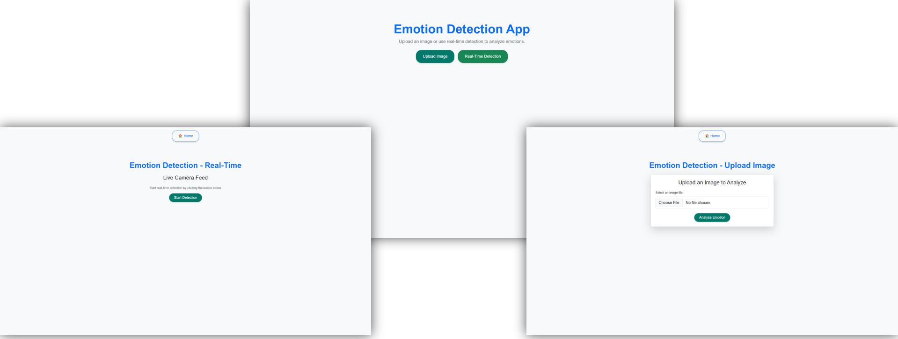

# **Emotion Detection in Images**

This repository hosts the code for a **Facial Emotion Recognition** app that identifies emotions (`Happy`, `Sad`, `Surprise`, and `Neutral`) from images and real-time video streams. The app utilizes a **VGG16 model fine-tuned** for emotion classification, **OpenCV** for image processing, **Haar cascades** for face detection, and a **Flask** backend with an **HTML/CSS** frontend.

---

## **Repository Structure**

```
📁 Models         # Trained deep learning model
📁 Notebooks      # Jupyter notebooks for data exploration, model training, and evaluation
📁 Screenshots    # Screenshots of the application
📁 static         # Static files (CSS and Icon)
📁 templates      # HTML templates
📄 .gitattributes # Git LFS configuration
📄 .gitignore     # Git ignore configuration
📄 app.py         # Flask application
📄 requirements.txt # Python dependencies
```
[Icon by Freepik](https://www.freepik.com/icon/smile_2383590)

---

## **Dataset**

The dataset used for training the model is the **FER-2013 dataset** (Facial Expression Recognition 2013), which is widely used for emotion detection tasks. You can access the dataset on [Kaggle here](https://www.kaggle.com/datasets/msambare/fer2013).

The data consists of **35,887 labeled 48x48-pixel grayscale images of faces**.

For this project, only the following four emotion classes were used: `Happy`, `Sad`, `Surprise`, and `Neutral`.

---

## **Features**

### **Methods and Techniques**
- **Data Augmentation**: Random transformations like rotation, flipping, and zooming to improve model generalization.
- **Dropout Layers**: Prevent co-adaptation of neurons and reduce overfitting.
- **L2 Regularization**: Penalizes large weights to encourage better generalization.
- **Batch Normalization**: Stabilizes training by normalizing intermediate layer outputs.
- **Callbacks**:
  - **EarlyStopping**: Stops training when validation performance ceases to improve.
  - **ReduceLROnPlateau**: Dynamically adjusts learning rates.
  - **ModelCheckpoint**: Saves the best-performing model during training.

### **User Interface**
The app features:
- **Real-Time Video Stream**: Detect emotions live using your webcam.
- **Image Upload**: Upload an image to detect emotions.

---

## **Installation**

1. **Clone the Repository**:
   ```bash
   git clone https://github.com/TouradBaba/emotion_detection_in_images.git
   cd emotion_detection_in_images
   ```

2. **Set Up a Virtual Environment** (Recommended):
   ```bash
   python -m venv env
   env\Scripts\activate  # For Mac/Linux: source env/bin/activate
   ```

3. **Install Dependencies**:
   ```bash
   pip install -r requirements.txt
   ```

4. **Run the Flask Application**:
   ```bash
   python app.py
   ```

5. **Access the Application**:  
   Open your web browser and go to:
   ```
   http://127.0.0.1:5000
   ```

---

## **Usage**

### **Image Upload**
1. Navigate to the **Upload** page from the home page.
2. Upload an image (JPEG/PNG).
3. The app will process the image, detect faces, and display the emotion labels.

### **Real-Time Detection**
1. Navigate to the **Real-Time Detection** page.
2. Click "Start" to begin real-time emotion detection using your webcam.
3. View emotions displayed on the live video feed.

---

## **Model Performance**

The model achieves an overall classification accuracy of **79.9%**. Below is the detailed breakdown of performance metrics:

| **Emotion/Metric** | **Precision** | **Recall** | **F1-Score** | **Support** |  
|--------------------|---------------|------------|--------------|-------------|  
| **Happy**          | 0.91          | 0.89       | 0.90         | 1774        |  
| **Sad**            | 0.69          | 0.76       | 0.72         | 1247        |  
| **Surprise**       | 0.86          | 0.86       | 0.86         | 831         |  
| **Neutral**        | 0.72          | 0.67       | 0.69         | 1233        |  

### **Explanation of Metrics**:
- **Precision**: Precision measures how many of the predicted positive instances are actually positive. In the context of emotion detection, it indicates how many of the predicted emotions were correct for each category. A higher precision means fewer false positives.
  
- **Recall**: Recall, also known as sensitivity, measures how many actual positive instances were correctly predicted. It shows how well the model identifies all instances of a particular emotion. A higher recall means fewer false negatives.

- **F1-Score**: The F1-score is the harmonic mean of precision and recall. It provides a balanced measure of the model’s performance, especially when dealing with imbalanced datasets. A higher F1-score indicates better overall performance in terms of both precision and recall.

---

## **Screenshots**

### **Screenshots of the Three Pages**



---

## **Code Style**
The code follows **PEP 8 guidelines** and includes:
- **Type Hinting**: Provides clarity about function inputs and outputs.
- **Docstrings**: Descriptions of all functions and modules.

---
